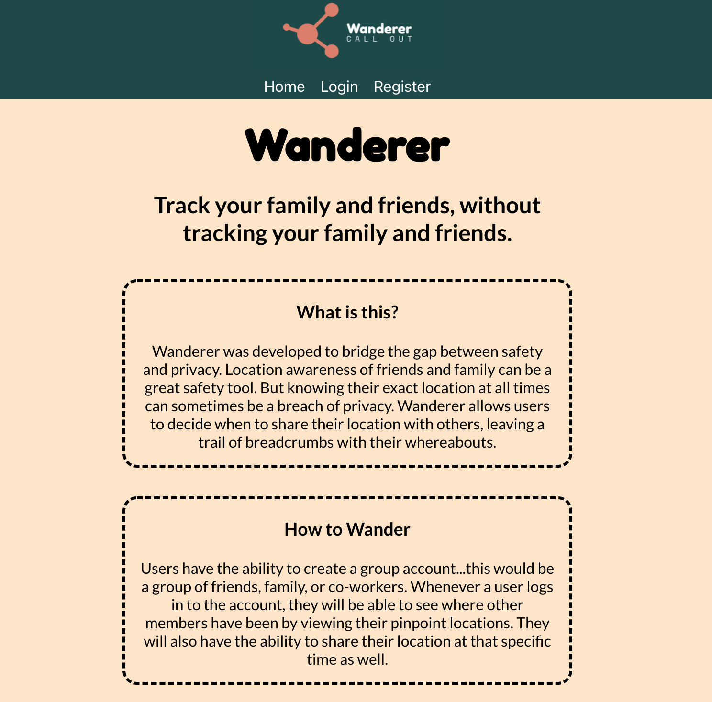
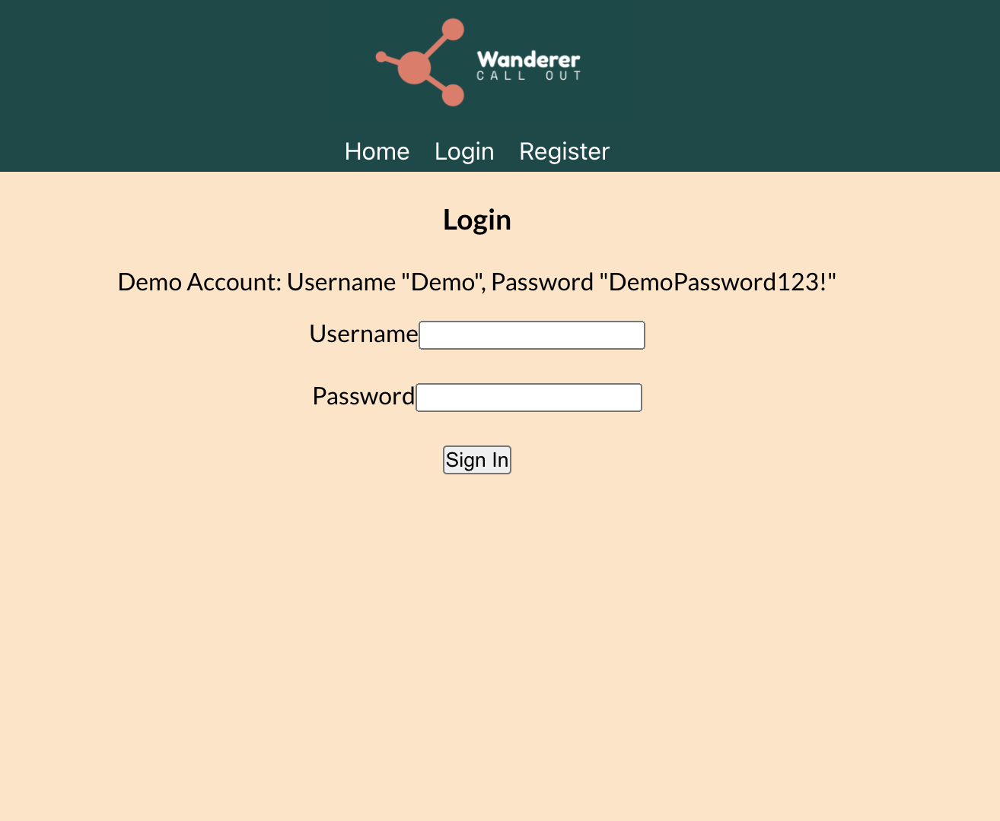
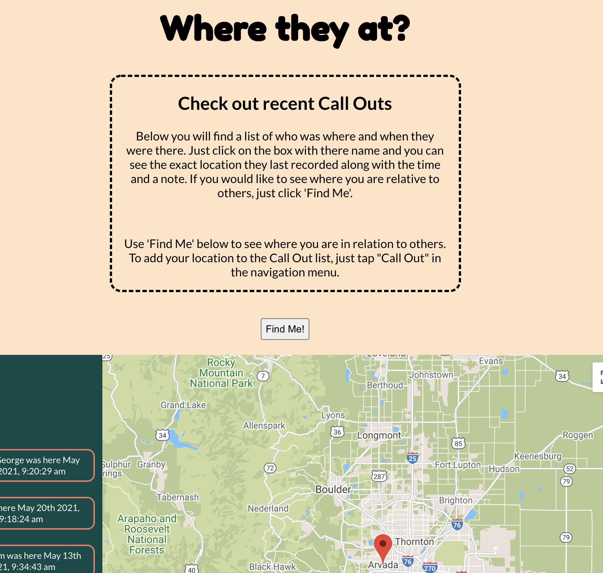
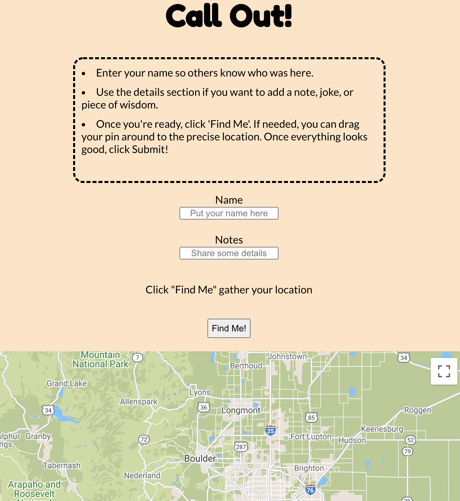

# Wanderer

Live app: (https://wanderer.vercel.app/)
 
API Repo: (https://github.com/alex-mccaffrey/wanderer-api)

## Table of Contents

- Summary
- Screenshots
- Technologies

## Summary

Wanderer was developed to bridge the gap between safety and privacy. Location awareness of friends and family can be a great safety tool. But knowing their exact location at all times can sometimes be a breach of privacy. Wanderer allows users to decide when to share their location with others, leaving a trail of breadcrumbs with their whereabouts.

## Screenshots

### Landing Page 

### Login

### User Dashboard

### Call Out: Add Your Location

## Technologies

For this app, I used:

- React.js
- Node.js
- PostgreSQL
- Express

## Upcoming Features:
- Tiered accounts (owner, members)
